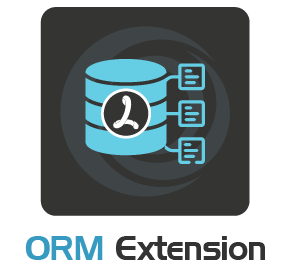

# Introduction

## Ortus ORM Extension

<figure><figcaption></figcaption></figure>

The [Ortus ORM Extension](https://www.ortussolutions.com/products/orm-extension) is a **native** Lucee Extension that allows your CFML application to integrate with the powerful [Hibernate ORM](https://hibernate.org/orm/). With Hibernate, you can interact with your database records in an object oriented fashion, using components to denote each record and simple getters and setters for each field value:

```js
component entityName="Auto" persistent="true" {

	property name="id" type="string" fieldtype="id" ormtype="string";
	property name="make" type="string";
	property name="model" type="string";

    function onPreInsert(){
        log.info( "Inserting new Auto: #getMake()# #getModel()#" );
    }
}
```

The Ortus ORM extension also enables transactional persistence, where an error during a save will roll back the entire transaction to prevent leaving the database in a broken state:

```js
transaction{
    try{
        entitySave(
            entityNew( "Purchase", {
                productID : "123-expensive-watch",
                purchaseTime : now(),
                customerID : customer.getId()
            })
        );
        var cartProducts = entityLoad( "CartProduct", customer.getID() );
        entityDelete( cartProducts );
    } catch ( any e ){
        // don't clear the user's cart if the purchase failed
        transactionRollback();
        rethrow;
    }
}
```

### Requirements

* Lucee 5.3.9.73 and above
* Java 8, 11 or 17

### Current Hibernate Version

The current version of HIbernate is **5.4** series:

* [https://hibernate.org/orm/releases/5.4/](https://hibernate.org/orm/releases/5.4/)
* [https://docs.jboss.org/hibernate/orm/5.4/userguide/html\_single/Hibernate\_User\_Guide.html](https://docs.jboss.org/hibernate/orm/5.4/userguide/html\_single/Hibernate\_User\_Guide.html)
* [https://docs.jboss.org/hibernate/orm/5.4/javadocs/](https://docs.jboss.org/hibernate/orm/5.4/javadocs/)

### Open Source Product

The Ortus ORM extension is an open source Lucee server extension with no license purchase necessary. If you are looking to further the development of this extension, consider [sponsoring a feature or opening a support contract](./#support).

### Features In A Nutshell

* Add Object Relational Mapping to any CFML app with Hibernate ORM
* Use native CFML methods to update and persist entities to the database (`entityNew()`, `entitySave()`, `ormFlush()`, etc.)
* Supports 80+ database dialects, from `SQLServer2005` to `MySQL8` and `PostgreSQL`
* 60% faster startup than the Lucee Hibernate extension
* Generate your mapping XML once and never again with the `autoGenMap=false` ORM configuration setting
* React to entity changes with pre and post event listeners such as `onPreInsert()`, `onPreUpdate()` and `onPreDelete()`
* Over 20 native CFML functions:
  * `EntityDelete()`
  * `EntityLoad()`
  * `EntityLoadByExample()`
  * `EntityLoadByPK()`
  * `EntityMerge()`
  * `EntityNameArray()`
  * `EntityNameList()`
  * `EntityNew()`
  * `EntityReload()`
  * `EntitySave()`
  * `EntityToQuery()`
  * `ORMClearSession()`
  * `ORMCloseAllSessions()`
  * `ORMEvictCollection()`
  * `ORMEvictEntity()`
  * `ORMEvictQueries()`
  * `ORMExecuteQuery()`
  * `ORMFlush()`
  * `ORMGetSession()`
  * `ORMGetSessionFactory()`
  * `ORMReload()`

See the [extension changelog](https://github.com/Ortus-Solutions/extension-hibernate/blob/master/CHANGELOG.md) for a full list of enhancements and bug fixes.

### Support

Our expertise with Hibernate ORM and Lucee Server allows us to give back to the community, as well as offer premium support to enterprises looking for a level up in their Hibernate implementations. If you need performance optimization, session management or caching integrations, please [contact us for support](https://ortussolutions.atlassian.net/servicedesk/customer/portal/9).

* Source Code: [https://github.com/Ortus-Solutions/extension-hibernate](https://github.com/Ortus-Solutions/extension-hibernate)
* Support Plans: [https://www.ortussolutions.com/services/support](https://www.ortussolutions.com/services/support)
* Bug Tracker: [https://ortussolutions.atlassian.net/browse/OOE](https://ortussolutions.atlassian.net/browse/OOE)
