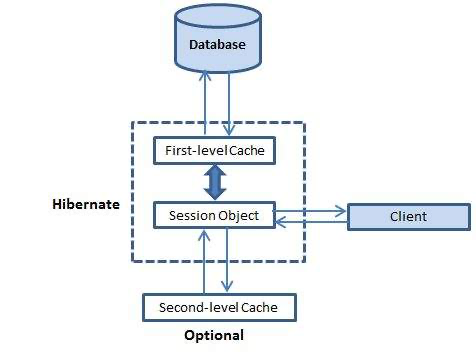

# Secondary Caches

Hibernate's secondary cache is a powerful tool that can greatly improve the performance of your application. By storing frequently accessed data in memory, the secondary cache can reduce the number of database queries that need to be made, resulting in faster response times and more efficient use of system resources. Whether you're working on a small project or a large enterprise application, the secondary cache is an essential part of any Hibernate-based system. So if you want to get the most out of your Hibernate application, take advantage of this powerful caching feature! &#x20;

<figure><figcaption></figcaption></figure>

Please see the [caching section](../../usage/caching.md) for all the wonderful caching strategies you can do with Hibernate.

### Configuration

A secondary cache provider is a class that manages a level of caching secondary to Hibernate's main caching context - the Hibernate session. A secondary cache enables longer-running cache contexts, more fine-grained control over cache busting, and other performance-related benefits.

The only setting necessary to enable secondary caching is the `secondaryCacheEnabled` setting:

```js
this.ormSettings = {
    secondaryCacheEnabled : true
};
```

To configure the caching, specify the path to an XML cache configuration file in `cacheConfig`:

```js
this.ormSettings = {
    secondaryCacheEnabled: true,
    cacheConfig          : "./config/ehcache.xml"
};
```

This `ehcache.xml` cache configuration then should look something like this:

```xml
<?xml version="1.0" encoding="UTF-8"?>
<ehcache
    xmlns:xsi="http://www.w3.org/2001/XMLSchema-instance"
    xsi:noNamespaceSchemaLocation="ehcache.xsd" updateCheck="true" name="default">
    <diskStore path="java.io.tmpdir"/>
        <defaultCache
            maxElementsInMemory="10000" eternal="false"
            timeToIdleSeconds="120" timeToLiveSeconds="120"
            maxElementsOnDisk="10000000" diskExpiryThreadIntervalSeconds="120"
            memoryStoreEvictionPolicy="LRU">
            <persistence strategy="localTempSwap"/>
        </defaultCache>
        <cache
            name="Autos"
            maxElementsInMemory="20"
            overflowToDisk="false"
            eternal="true">
        </cache>
</ehcache>
```

### Alternate Cache Providers Are Unsupported

While there is a `cacheProvider` setting, only EHCache (currently) is supported as a secondary cache provider.

```js
this.ormSettings = {
    secondaryCacheEnabled : true,
    // NOT SUPPORTED!
    cacheProvider : "ConcurrentHashMap"
};
```

Thus, any usage of `cacheProvider` other than `"ehcache"` will be ignored.
